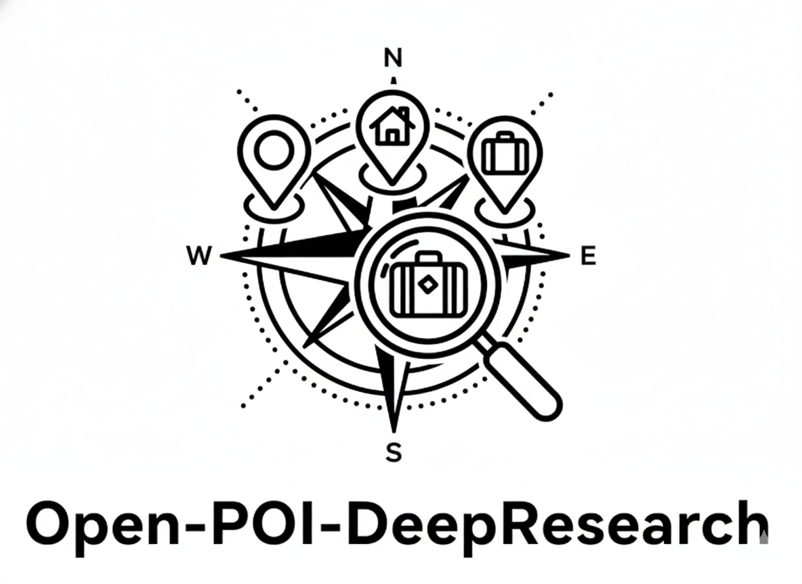

<p align="center">
  
</p>

[English](README.md) | [中文](README_ZH.md) | [한국어](README_ko.md) | 日本語

# Open-POI-Deepresearchプロジェクトの概要

Open-POI-Deepresearchプロジェクトは、全方位的な旅行計画支援ツールです。個人向けの各種旅行サービスを提供しており、例えば周辺の○○を検索したり、旅行計画を作成したりすることができ、一括で高德ナビゲーション/タクシーのリンクを生成することも可能です。本プロジェクトは高德mcpが提供する旅行ツールサービスを利用しており、深度検索と自己検証をサポートしています。不確定な情報については、askhumanツールを通じて確認を求めることができます。また、最終バージョンではストリーミングに対応する予定です（現在開発中）。このプロジェクトが、皆様各自の旅行計画支援ツールを構築する際に役立つことを期待しています。

Open-POI-DeepresearchプロジェクトはOpenManusプロジェクトを基に開発されており、実行環境はOpenManusと同じです。ユーザーは以下のOpenManusプロジェクトの紹介に従って対応する環境をインストールした後、Open-POI-Deepresearchが提供するserver_web.pyを使用してサービスを起動するだけです（コマンド：python server_web.py）。

# 👋 OpenManus

Manusは素晴らしいですが、OpenManusは*招待コード*なしでどんなアイデアも実現できます！🛫

私たちのチームメンバー [@Xinbin Liang](https://github.com/mannaandpoem) と [@Jinyu Xiang](https://github.com/XiangJinyu)（主要開発者）、そして [@Zhaoyang Yu](https://github.com/MoshiQAQ)、[@Jiayi Zhang](https://github.com/didiforgithub)、[@Sirui Hong](https://github.com/stellaHSR) は [@MetaGPT](https://github.com/geekan/MetaGPT) から来ました。プロトタイプは3時間以内に立ち上げられ、継続的に開発を進めています！

これはシンプルな実装ですので、どんな提案、貢献、フィードバックも歓迎します！

OpenManusで自分だけのエージェントを楽しみましょう！

また、UIUCとOpenManusの研究者が共同開発した[OpenManus-RL](https://github.com/OpenManus/OpenManus-RL)をご紹介できることを嬉しく思います。これは強化学習（RL）ベース（GRPOなど）のLLMエージェントチューニング手法に特化したオープンソースプロジェクトです。

## プロジェクトデモ

<video src="https://private-user-images.githubusercontent.com/61239030/420168772-6dcfd0d2-9142-45d9-b74e-d10aa75073c6.mp4?jwt=eyJhbGciOiJIUzI1NiIsInR5cCI6IkpXVCJ9.eyJpc3MiOiJnaXRodWIuY29tIiwiYXVkIjoicmF3LmdpdGh1YnVzZXJjb250ZW50LmNvbSIsImtleSI6ImtleTUiLCJleHAiOjE3NDEzMTgwNTksIm5iZiI6MTc0MTMxNzc1OSwicGF0aCI6Ii82MTIzOTAzMC80MjAxNjg3NzItNmRjZmQwZDItOTE0Mi00NWQ5LWI3NGUtZDEwYWE3NTA3M2M2Lm1wND9YLUFtei1BbGdvcml0aG09QVdTNC1ITUFDLVNIQTI1NiZYLUFtei1DcmVkZW50aWFsPUFLSUFWQ09EWUxTQTUzUFFLNFpBJTJGMjAyNTAzMDclMkZ1cy1lYXN0LTElMkZzMyUyRmF3czRfcmVxdWVzdCZYLUFtei1EYXRlPTIwMjUwMzA3VDAzMjIzOVomWC1BbXotRXhwaXJlcz0zMDAmWC1BbXotU2lnbmF0dXJlPTdiZjFkNjlmYWNjMmEzOTliM2Y3M2VlYjgyNDRlZDJmOWE3NWZhZjE1MzhiZWY4YmQ3NjdkNTYwYTU5ZDA2MzYmWC1BbXotU2lnbmVkSGVhZGVycz1ob3N0In0.UuHQCgWYkh0OQq9qsUWqGsUbhG3i9jcZDAMeHjLt5T4" data-canonical-src="https://private-user-images.githubusercontent.com/61239030/420168772-6dcfd0d2-9142-45d9-b74e-d10aa75073c6.mp4?jwt=eyJhbGciOiJIUzI1NiIsInR5cCI6IkpXVCJ9.eyJpc3MiOiJnaXRodWIuY29tIiwiYXVkIjoicmF3LmdpdGh1YnVzZXJjb250ZW50LmNvbSIsImtleSI6ImtleTUiLCJleHAiOjE3NDEzMTgwNTksIm5iZiI6MTc0MTMxNzc1OSwicGF0aCI6Ii82MTIzOTAzMC80MjAxNjg3NzItNmRjZmQwZDItOTE0Mi00NWQ5LWI3NGUtZDEwYWE3NTA3M2M2Lm1wND9YLUFtei1BbGdvcml0aG09QVdTNC1ITUFDLVNIQTI1NiZYLUFtei1DcmVkZW50aWFsPUFLSUFWQ09EWUxTQTUzUFFLNFpBJTJGMjAyNTAzMDclMkZ1cy1lYXN0LTElMkZzMyUyRmF3czRfcmVxdWVzdCZYLUFtei1EYXRlPTIwMjUwMzA3VDAzMjIzOVomWC1BbXotRXhwaXJlcz0zMDAmWC1BbXotU2lnbmF0dXJlPTdiZjFkNjlmYWNjMmEzOTliM2Y3M2VlYjgyNDRlZDJmOWE3NWZhZjE1MzhiZWY4YmQ3NjdkNTYwYTU5ZDA2MzYmWC1BbXotU2lnbmVkSGVhZGVycz1ob3N0In0.UuHQCgWYkh0OQq9qsUWqGsUbhG3i9jcZDAMeHjLt5T4" controls="controls" muted="muted" class="d-block rounded-bottom-2 border-top width-fit" style="max-height:640px; min-height: 200px"></video>

## インストール方法

インストール方法は2つ提供しています。方法2（uvを使用）は、より高速なインストールと優れた依存関係管理のため推奨されています。

### 方法1：condaを使用

1. 新しいconda環境を作成します：

```bash
conda create -n open_manus python=3.12
conda activate open_manus
```

2. リポジトリをクローンします：

```bash
git clone https://github.com/FoundationAgents/OpenManus.git
cd OpenManus
```

3. 依存関係をインストールします：

```bash
pip install -r requirements.txt
```

### 方法2：uvを使用（推奨）

1. uv（高速なPythonパッケージインストーラーと管理機能）をインストールします：

```bash
curl -LsSf https://astral.sh/uv/install.sh | sh
```

2. リポジトリをクローンします：

```bash
git clone https://github.com/FoundationAgents/OpenManus.git
cd OpenManus
```

3. 新しい仮想環境を作成してアクティベートします：

```bash
uv venv --python 3.12
source .venv/bin/activate  # Unix/macOSの場合
# Windowsの場合：
# .venv\Scripts\activate
```

4. 依存関係をインストールします：

```bash
uv pip install -r requirements.txt
```

### ブラウザ自動化ツール（オプション）

```bash
playwright install
```

## 設定

OpenManusを使用するには、LLM APIの設定が必要です。以下の手順に従って設定してください：

1. `config`ディレクトリに `config.toml`ファイルを作成します（サンプルからコピーできます）：

```bash
cp config/config.example.toml config/config.toml
```

2. `config/config.toml`を編集してAPIキーを追加し、設定をカスタマイズします：

```toml
# グローバルLLM設定
[llm]
model = "gpt-4o"
base_url = "https://api.openai.com/v1"
api_key = "sk-..."  # 実際のAPIキーに置き換えてください
max_tokens = 4096
temperature = 0.0

# 特定のLLMモデル用のオプション設定
[llm.vision]
model = "gpt-4o"
base_url = "https://api.openai.com/v1"
api_key = "sk-..."  # 実際のAPIキーに置き換えてください
```

## クイックスタート

OpenManusを実行する一行コマンド：

```bash
python main.py
```

その後、ターミナルからプロンプトを入力してください！

MCP ツールバージョンを使用する場合は、以下を実行します：

```bash
python run_mcp.py
```

開発中のマルチエージェントバージョンを試すには、以下を実行します：

```bash
python run_flow.py
```

## カスタムマルチエージェントの追加

現在、一般的なOpenManusエージェントに加えて、データ分析とデータ可視化タスクに適したDataAnalysisエージェントが組み込まれています。このエージェントを `config.toml`の `run_flow`に追加することができます。

```toml
# run-flowのオプション設定
[runflow]
use_data_analysis_agent = true     # デフォルトでは無効、trueに変更すると有効化されます
```

これに加えて、エージェントが正常に動作するために必要な依存関係をインストールする必要があります：[具体的なインストールガイド](app/tool/chart_visualization/README_ja.md##インストール)

## 貢献方法

我々は建設的な意見や有益な貢献を歓迎します！issueを作成するか、プルリクエストを提出してください。

または @mannaandpoem に📧メールでご連絡ください：mannaandpoem@gmail.com

**注意**: プルリクエストを送信する前に、pre-commitツールを使用して変更を確認してください。`pre-commit run --all-files`を実行してチェックを実行します。

## コミュニティグループ

Feishuのネットワーキンググループに参加して、他の開発者と経験を共有しましょう！

<div align="center" style="display: flex; gap: 20px;">
    
</div>

## スター履歴

[](https://star-history.com/#FoundationAgents/OpenManus&Date)

## 謝辞

このプロジェクトの基本的なサポートを提供してくれた[anthropic-computer-use](https://github.com/anthropics/anthropic-quickstarts/tree/main/computer-use-demo)
と[browser-use](https://github.com/browser-use/browser-use)に感謝します！

さらに、[AAAJ](https://github.com/metauto-ai/agent-as-a-judge)、[MetaGPT](https://github.com/geekan/MetaGPT)、[OpenHands](https://github.com/All-Hands-AI/OpenHands)、[SWE-agent](https://github.com/SWE-agent/SWE-agent)にも感謝します。

また、Hugging Face デモスペースをサポートしてくださった阶跃星辰 (stepfun)にも感謝いたします。

OpenManusはMetaGPTのコントリビューターによって構築されました。このエージェントコミュニティに大きな感謝を！

## 引用

```bibtex
@misc{openmanus2025,
  author = {Xinbin Liang and Jinyu Xiang and Zhaoyang Yu and Jiayi Zhang and Sirui Hong and Sheng Fan and Xiao Tang},
  title = {OpenManus: An open-source framework for building general AI agents},
  year = {2025},
  publisher = {Zenodo},
  doi = {10.5281/zenodo.15186407},
  url = {https://doi.org/10.5281/zenodo.15186407},
}
```
